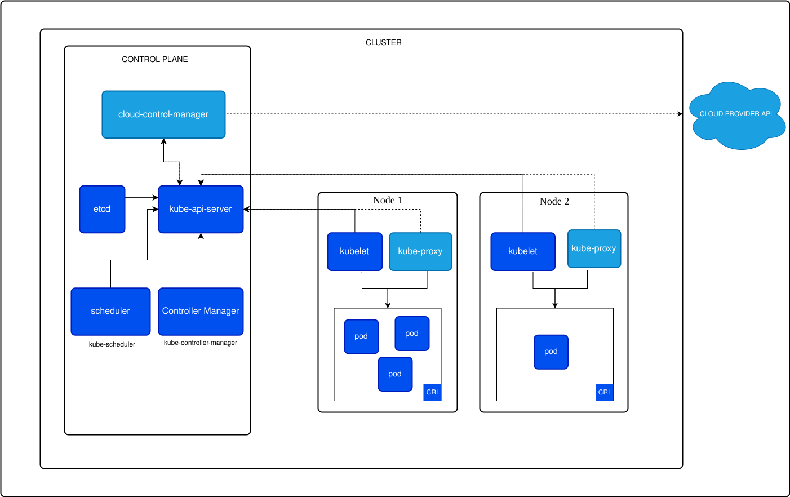
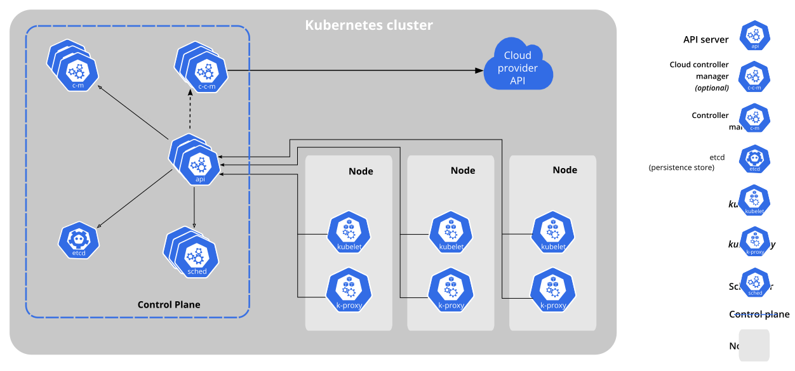

# Kubernetes Cluster Architecture 

- We will start with Cluster Architecture

## Key Attributes of the Clusters 

- [**Node**](13-Nodes.md) : A node is a worker machine in Kubernetes, that takes care of the workload for a particular application(s). Each node is maintained by Controlplane and has components like Kubelet, Container Runtime Interface(CRI) and Kubeproxy. 

- [**Kubelet**](07-Kubelet.md) : This is the primary "node agent" that runs on each node. The kubelet works in terms of PodSpec (a yaml or json object that describes a pod)

- [**kube-proxy**](08-Kube-Proxy.md) : The kubernetes network proxy runs on each node. This reflects services as defined in the Kubernetes API on each node and can do simple TCP, UDP, and SCTP stream forwarding or round-robin TCP, UDP, and SCTP forwarding across a set of backends. Services can be of many flavors: ClusterIP and NodePort

- [**Controlplane**](03-Kubernetes-Controlplane.md) : Container orchestration layer that exposes the API and interfaces to define, deploy, and manage the lifecycle of containers. 
It contains 
  - etcd 
  - API server
  - Scheduler 
  - Controller Manager
  - Cloud Controller Manager

## Kubernetes Components 

### Core Component 

- Controlplane Components - manages overall state of the cluster
  - [Kube-apiserver](02-Kube-API-Server.md) 
  - [etcd](04-ETCD-server.md)
  - [kube-scheduler](05-Kube-Scheduler.md)
  - [kube-controller-manager](14-Kube-Controller-Manager.md)
  - [cloud-controller-manager](12-Cloud-Controller-Manager.md)

### Node Components 
- [Kubelet](07-Kubelet.md)
- [Kube-proxy](08-Kube-Proxy.md) 
- [Container Runtime](09-Container-Runtime-Interface.md)

### Addons 
- DNS
- Container Resource Monitoring
- Cluster-level Logging