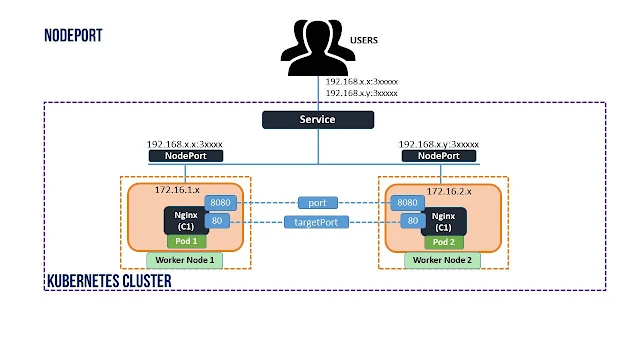

# Kubernetes Services 

- In Kubernetes, a Service exposes a network application running as one or more Pods in your cluster.
- Key aim:
  - No need to modify your existing application for an unfamiliar service discovery mechanism.
- You can run code in Pods:
  - Designed for a cloud-native world.
  - Older containerized apps.
- A Service makes the set of Pods available on the network for client interaction.

## Kubernetes Service Type

Kubernetes Service types allow you to specify what kind of Service you want. The available types and their behaviors are:

- [**ClusterIP**](/docs/04%20-%20Network%20%26%20Services/02-ClusterIP.md):
  - Exposes the Service on a cluster-internal IP.
  - Makes the Service reachable only within the cluster.
  - Default type if not specified.
  - Can be exposed to the public internet using an Ingress or Gateway. 
  

- [**NodePort**](/docs/04%20-%20Network%20%26%20Services/06-NodePort.md)
  - Exposes the Service on each Node's IP at a static port (the NodePort).
  - Sets up a cluster IP address similar to ClusterIP.
  

- [**LoadBalancer**](/docs/04%20-%20Network%20%26%20Services/04-LoadBalancer.md):
  - Exposes the Service externally using an external load balancer.
  - Requires an external load balancer or integration with a cloud provider.
  

- *ExternalName*:
  - Maps the Service to the contents of the externalName field (e.g., hostname api.foo.bar.example).
  - Configures the cluster's DNS server to return a CNAME record with the external hostname value.
  - No proxying is set up.
  

